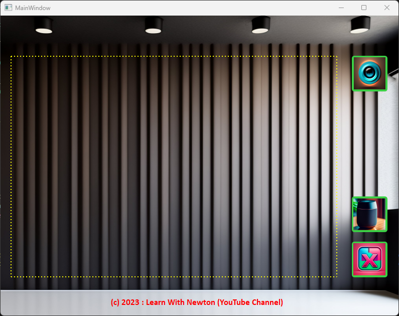

### Pre-requisite

1. Visual Studio Code
2. Python 3.9 or greater

### Install required packages

1. Change directory to where the `requirements.txt` file is placed.


2. Install all the required package by running the below command

```
pip install -r requirements.txt
```

### Open QT Designer for designing WebCam Desktop App

1. Go to the directory where `pyqt5-tools` are installed and create a shortcut to desktop
2. Open the Desinger and start desinging the app as below:


